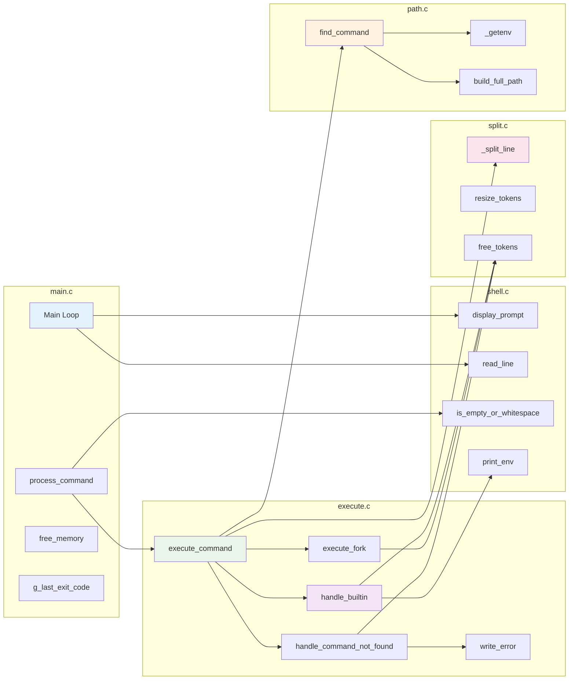
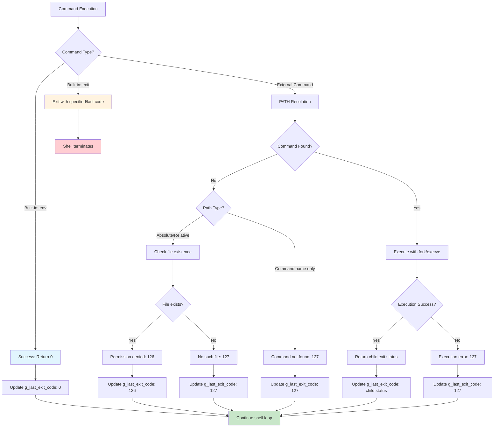

# 🐚 Simple Shell Flowchart

## Architecture et Flux d'Exécution

```mermaid
flowchart TD
    A[Start Shell] --> B{Interactive Mode?}
    
    B -->|Yes| C[Display Prompt: #cisfun$]
    B -->|No| D[Read from stdin/file]
    
    C --> E[Read User Input]
    D --> E
    
    E --> F{Input is NULL?<br/>EOF detected}
    F -->|Yes| G[Exit Shell<br/>Return last exit code]
    
    F -->|No| H[Check if empty/whitespace]
    H -->|Yes| I{Interactive?}
    I -->|Yes| C
    I -->|No| E
    
    H -->|No| J[Copy command string]
    J --> K[Parse command into arguments<br/>split.c: _split_line()]
    
    K --> L{Parsing Success?}
    L -->|No| M[Free memory<br/>Return to input loop]
    M --> N{Interactive?}
    N -->|Yes| C
    N -->|No| E
    
    L -->|Yes| O{Is Built-in Command?}
    
    O -->|Yes: exit| P[handle_builtin: exit]
    P --> Q{Exit has argument?}
    Q -->|No| R[Use g_last_exit_code]
    Q -->|Yes| S[Parse exit code with atoi]
    R --> T[Free memory & exit with code]
    S --> T
    
    O -->|Yes: env| U[handle_builtin: env]
    U --> V[Print environment variables<br/>using printf]
    V --> W[Free memory & return success]
    
    O -->|No| X[Find command in PATH<br/>path.c: find_command()]
    
    X --> Y{Command contains '/'?}
    Y -->|Yes| Z[Validate absolute/relative path<br/>using access(X_OK)]
    Y -->|No| AA[Search in PATH directories]
    
    Z --> BB{Path exists & executable?}
    BB -->|No| CC[Return NULL]
    BB -->|Yes| DD[Return strdup(path)]
    
    AA --> EE[Get PATH environment variable<br/>_getenv(PATH)]
    EE --> FF{PATH exists?}
    FF -->|No| CC
    FF -->|Yes| GG[Split PATH by ':' delimiter]
    
    GG --> HH[For each directory in PATH]
    HH --> II[Build full path: dir/command<br/>build_full_path()]
    II --> JJ{File exists & executable?<br/>access(X_OK)}
    
    JJ -->|No| KK{More directories?}
    KK -->|Yes| HH
    KK -->|No| CC
    
    JJ -->|Yes| LL[Return allocated full path]
    
    CC --> MM[handle_command_not_found()]
    MM --> NN{Is absolute/relative path?}
    NN -->|Yes| OO[Check with stat()]
    OO --> PP{File exists?}
    PP -->|Yes| QQ[Error: Permission denied<br/>Exit code 126]
    PP -->|No| RR[Error: No such file or directory<br/>Exit code 127]
    
    NN -->|No| SS[Error: command not found<br/>Exit code 127]
    
    DD --> TT[execute_fork()]
    LL --> TT
    
    TT --> UU[fork() system call]
    UU --> VV{Fork success?}
    VV -->|No| WW[Error: fork failed<br/>Return code 1]
    
    VV -->|Yes| XX{Child or Parent?}
    
    XX -->|Child Process| YY[execve(path, argv, environ)]
    YY --> ZZ{execve success?}
    ZZ -->|No| AAA[perror() & _exit(127)]
    ZZ -->|Yes| BBB[Command executes<br/>_exit(0)]
    
    XX -->|Parent Process| CCC[wait(&status)]
    CCC --> DDD[Free allocated memory]
    DDD --> EEE{Child exited normally?<br/>WIFEXITED(status)}
    EEE -->|Yes| FFF[Return WEXITSTATUS(status)]
    EEE -->|No| GGG[Return 1]
    
    W --> HHH[Update g_last_exit_code]
    QQ --> HHH
    RR --> HHH
    SS --> HHH
    WW --> HHH
    FFF --> HHH
    GGG --> HHH
    
    HHH --> III{Interactive Mode?}
    III -->|Yes| C
    III -->|No| E
    
    style A fill:#e1f5fe
    style G fill:#ffcdd2
    style T fill:#ffcdd2
    style C fill:#f3e5f5
    style E fill:#e8f5e8
    style O fill:#fff3e0
    style X fill:#e0f2f1
    style TT fill:#fce4ec
    style MM fill:#ffebee
```

## Modules et Responsabilités



## Gestion des Erreurs et Codes de Sortie


