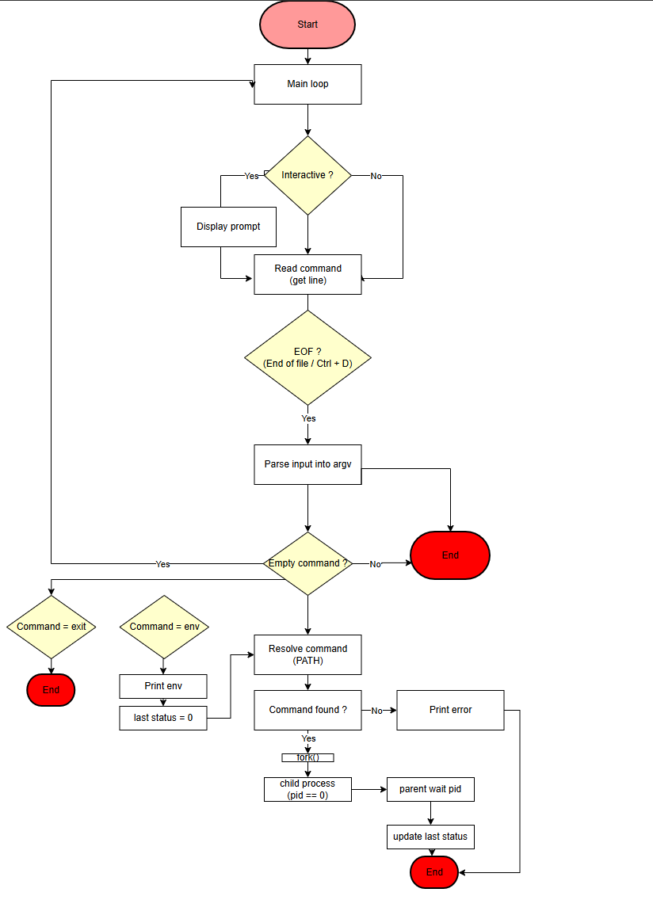

gcc -Wall -Werror -Wextra -pedantic -std=gnu89 *.c -o hsh
echo "ls" | ./hsh
echo "pwd" | ./hsh
printf "ls\nwhoami\n" | ./hsh
gcc -Wall -Werror -Wextra -pedantic -std=gnu89 *.c -o hsh
# Simple Shell

This README has been tailored to this repository's actual files and assets.

Simple Shell Description

This project implements a simple UNIX command interpreter in C. It reproduces the basic behavior of a UNIX shell: interactive and non-interactive modes, PATH lookup, process creation (fork/execve), environment passing, and a small set of built-ins.

## What this README contains

- Project overview and features
- How to compile and run the shell
- Project file layout (based on repository files)
- Flowchart (image included)
- Manual page preview (image included)
- Error handling and exit codes

## Features

- Interactive prompt
- Non-interactive (pipeline/file) mode
- Executes commands by absolute path or via `$PATH` lookup
- Built-in commands: `exit`, `env`
- Proper exit status management (0, 126, 127, 128+signal)
- Unix-like formatted error messages

## Requirements

- Linux (Ubuntu 20.04+ recommended)
- `gcc` (GNU Compiler Collection)
- Optional: `valgrind` for memory checks

## Compile

From the project root:

```bash
gcc -Wall -Werror -Wextra -pedantic -std=gnu89 *.c -o hsh
```

This builds the executable `hsh` (or `hsh` may already exist in the repo as `hsh`).

## Project structure (actual files)

```
.
├── AUTHORS
├── README.md
├── builtins.c        # built-in commands implementation (exit, env)
├── errors.c          # error message helpers and formatting
├── exec.c            # fork/exec and execution flow
├── hsh               # compiled binary (optional/check-in)
├── img/              # images: flowchart, man page preview
│   ├── flowchart.png
│   └── man page.png
├── man_1_simple_shell # manual page file
├── parser.c          # input parsing and tokenization
├── path.c            # PATH lookup and helpers
├── shell.c           # main loop and prompt handling
└── shell.h           # shared prototypes and includes
```

> Note: filenames above were taken from the repository root and reflect the code you provided.

## Usage

Interactive:

```bash
./hsh
#cisfun$ ls
```

Non-interactive examples:

```bash
echo "ls" | ./hsh
printf "pwd\nwhoami\n" | ./hsh
```

## Flowchart

The repository contains a flowchart illustrating the shell's process flow. See the image below (stored in `img/flowchart.png`).



## Manual page preview

A manual page is included as `man_1_simple_shell`. A visual preview is provided in `img/man page.png`:


View the manual page using:

```bash
man ./man_1_simple_shell
```

## Error handling & return codes

- 0: Success
- 126: Command not executable (permission denied)
- 127: Command not found
- 128 + n: Command terminated by signal `n`

Errors are printed using a shell-like format: `program_name: line_number: command: message`.

## Testing & debugging

Compile with the flags above and run `valgrind` to check for leaks:

```bash
valgrind --leak-check=full ./hsh
```

## Authors

- Joshua Burle (Joshuaburle)

## License

This project is part of the Holberton School curriculum and is provided for educational purposes.
